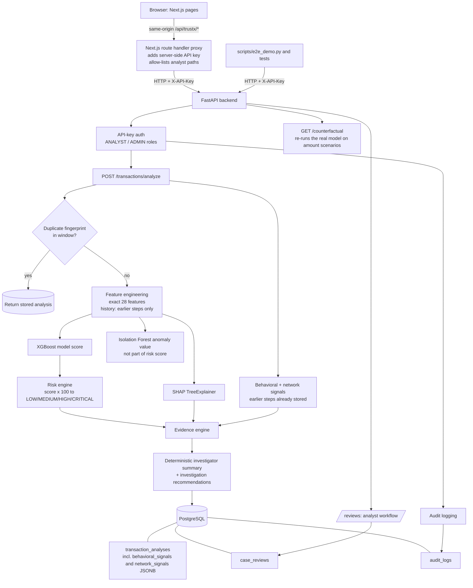

# TrustX architecture (as implemented)

This diagram shows only components that exist in the repository. There is **no** Redis, Kafka, WebSocket,
streaming pipeline, simulator service, model-calibration service, or background worker. Analysis is a
synchronous request/response call.

## Request flow for `POST /api/v1/transactions/analyze`

1. API key is checked (ANALYST or ADMIN); an in-process rate limit applies.
2. Input is validated (length limits, ranges, no unknown fields); body size is capped at 256 KiB.
3. A SHA-256 fingerprint of the transaction's own fields is looked up; an identical transaction inside the duplicate
   window (default 24 h) returns the stored analysis with `is_duplicate = true`.
4. The 28 features are built (history rows with `step < current step` only), XGBoost and the Isolation Forest are scored,
   SHAP is computed, the risk engine maps the model score to a level and recommended action.
5. Behavioral and network signals are computed from stored analyses with a strictly earlier `step` that already existed
   when the analysis started. **They are persisted with the analysis**, so later transactions never change them.
6. The evidence and a deterministic investigator summary are built and the whole analysis is stored.
7. An audit entry is written (`TRANSACTION_ANALYZE`).

## Human review

HIGH and CRITICAL assessments appear in the dashboard review queue. An analyst creates and updates a review
(`OPEN`, `UNDER_REVIEW`, `DISMISSED`, `ESCALATED`, `CONFIRMED_SUSPICIOUS`) through `/api/v1/reviews`. The review is
stored separately from the model output; it never changes `fraud_probability`, `risk_level` or `recommended_action`.

## Not in the architecture (deliberately)

Redis, Kafka/Celery, WebSocket or other streaming, graph databases, feature stores, microservices, LLMs, OAuth,
model calibration/versioning services, a transaction simulator, Docker/Kubernetes deployment.
